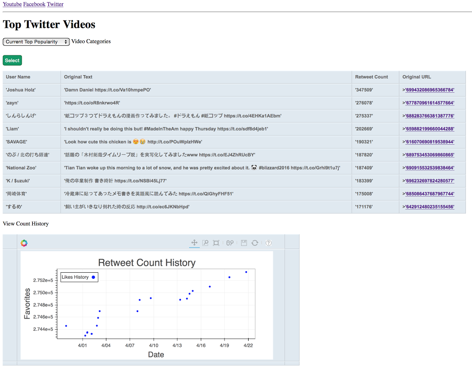
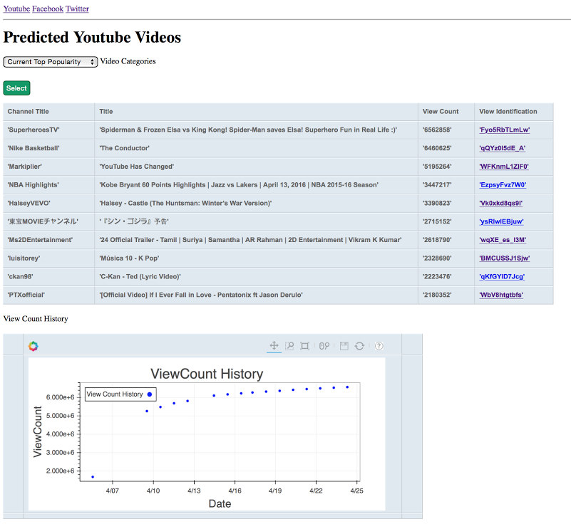

*Megan Jasek, Charles Kekeh, Alejandro Rojas, Andrea Soto*

**W251 Scaling Up! Really Big Data Final Project**

A detailed report is located [here](https://github.com/abessou/w251-FinalProject/blob/develop/Report.pdf) and the class presentation is located [here](https://github.com/abessou/w251-FinalProject/blob/develop/Presentation.pdf)

# Project Overview

In this project we implement a rating system for videos published on the social media sites Twitter, Facebook and Youtube.

## Introduction

The goal of our final project was to identify popular videos that engage users across social media platforms. To do this, we built an application that ingests video metadata from Twitter, Facebook and Youtube, and analyzes the content on two fronts: a batch mode and a stream mode. 

The application works with the different platforms, connects to their API, parses the JSON response from each platform and stores the data in a MongoDB data store, while also adhering to the terms of use and rate limits of each API. With the data in a database, we can display the 10 most popular videos on each site and how the popularity of the video has evolved. Finally, we did some off-line analytics which include some exploratory data analysis, sentiment analysis, and prediction model.

To make our corpus of data, we continuously query the platforms for a list of predefined topics and filter each post to extract the video information relevant for our analysis.

## Business Opportunity

In the last 5 years, video growth has been remarkable. A fact that has not been missed by major social networks. Twitter, Facebook, and Google are all devoting significant resources to growing their video presence.

Content creators have also been scrambling to churn out video content that strikes a note with their audiences. New media outlets like BuzzFeed and Upworthy are increasingly focusing on developing video content that becomes viral on social networks. With the rise of smartphones, consumers are also adding their set of video content to the mix. All this growth in video content publication and consumption is creating a need that our application wants to attend. 

# Architecture

The overall architecture of the project is shown in the figure below.


The data was collected from three sources: Twitter, Facebook, and Youtube.  The independent ingestion processes connected to the API’s of each source and gathered metadata on videos. 

The data was parsed and stored in a single node, MongoDB database. 

The web server connects to MongoDB to show the most popular videos for each source in real-time. The analysis was done off-line, and includes some exploratory data analysis and a prediction model. 

## Data Ingest Pipeline

The ingestion of data had to be customized for each source because each API was different. Twitter and Facebook are not video sites, so the ingestion of video metadata was not as straightforward as with Youtube, where we could directly query for recently posted videos. 

For Twitter, we used the Streaming API to get a stream of tweets. We filtered the tweets that had video content associated to it and stored their metadata in MongoDB. For Facebook, we used the Graph API to search for public pages and get all the videos posted by each page. For Youtube, we use the Data API to search for videos posted in the last 24 hours.

An overview of the data ingestion processes is shown in the diagram below.


The ingestion processes for Twitter and Facebook were continuous, whereas the Youtube process was scheduled to start every 24 hours by a Cron scheduler and would stop when finished.

# Analysis and Prediction

One of our main goals was to predict whether a newly posted video would become popular or not. Since our data was not labeled, we created a binary labeled based on the following popularity counts:

- Retweets for Twitter videos
- Likes for Facebook videos
- Views for Youtube videos

If a video’s popularity measure was above the 75th percentile, it would be labelled as popular (1). Otherwise it would be labelled as not popular (0).

The project used data from the 3 data sources to make a prediction of whether a video would be popular or not.

A logistic regression model was trained on data collected form March 25, 2016 to April 4, 2016, and tested on data collected from April 5, 2016 and after. 

Spark and MLlib were used for the analysis and prediction.

# Front-End UI

The following screen captures provide details of our project UI for two scenarios selected.

## Display of the most popular twitter videos



## Display of Youtube videos that were predicted to become popular




# Code Structure

The core entry point is the `DataIngest.py` script. Data Ingest expects a configuration file as an argument that defines and configures the sink and source for the instance (this construct keeps the code separate from the data, especially sensitive credentials). The syntax to run it is:

```sh
python DataIngest.py --config configFiles/config-file.cfg
```

Where the configuration file is at `configFiles/config-file.cfg` on the local filesystem.

The Data Ingest script relies on a number of data source implementations represented as Python classes:
- `TwitterDataIngestSource.py` - Source for ingesting data from the Twitter 1.1 Streaming API
- `FacebookDataIngestSource.py` - Source for ingesting data from the Facebook 2.5 Graph REST API
- `YouTubeDataIngestSource.py` - Source for ingesting data from the Youtube v3 Data REST API
- `S3DataIngestSource.py` - Source for ingesting data from S3 (typically, in a replay of a ingest from one or more of the above)
- `LocalDataIngestSource.py` - Source for ingesting data from the local filesystem (typically, in a replay of a ingest from one or more of the above)

Sinks are duck-typed with the expectation that they expose a stream of data as a Python iterable. In other words:
```{python}
for item in source:
  do_something_with(item)
```
The Data Ingest script has several optional data sink implementations. However, only the Mongo sink was used in our project.

The code also includes three examples of configuration files (without credentials):

- `.sample-twitter-to-mongo.cfg` - Ingest data from Twitter to MongoDB
- `.sample-facebook-to-mongo.cfg` - Ingest data from Facebook to MongoDB
- `.sample-youtube-to-mongo.cfg` - Ingest a data sfrom Youtube to MongoDB

---

*Megan Jasek, Charles Kekeh, Alejandro Rojas, Andrea Soto*

